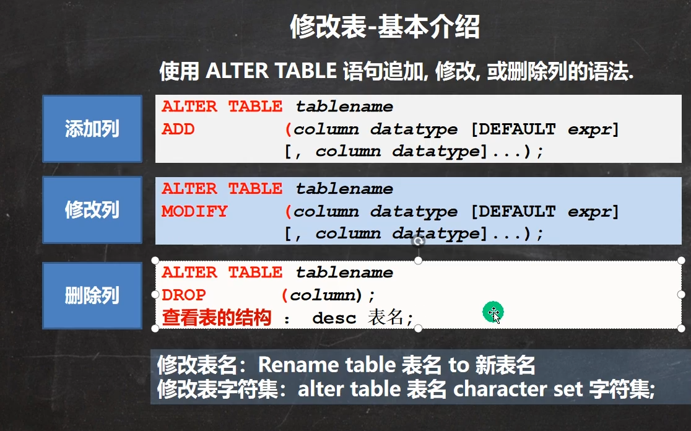

* content
  {:toc}

  


```mysql
#修改表的操作练习
-- 员工表 emp 的上增加一个 image 列，varchar 类型(要求在 resume 后面)。
ALTER TABLE employee
ADD image VARCHAR(32) NOT NULL DEFAULT '' AFTER RESUME
DESC employee -- 显示表结构，可以查看表的所有列
-- 修改 job 列，使其长度为 60。
ALTER TABLE employee
MODIFY job VARCHAR(60) NOT NULL DEFAULT '' -- 删除 sex 列。
ALTER TABLE emplopee
DROP sex
-- 表名改为 employee。
RENAME TABLE emp TO employee
-- 修改表的字符集为 utf8
ALTER TABLE employee CHARACTER SET utf8
-- 列名 name 修改为 user_name
ALTER TABLE employee
CHANGE `name` `user_name` VARCHAR(64) NOT NULL DEFAULT '' 

DESC employee
#NOT NULL DEFAULT '' 的意思是不允许为空，以'' 填充
	
```

