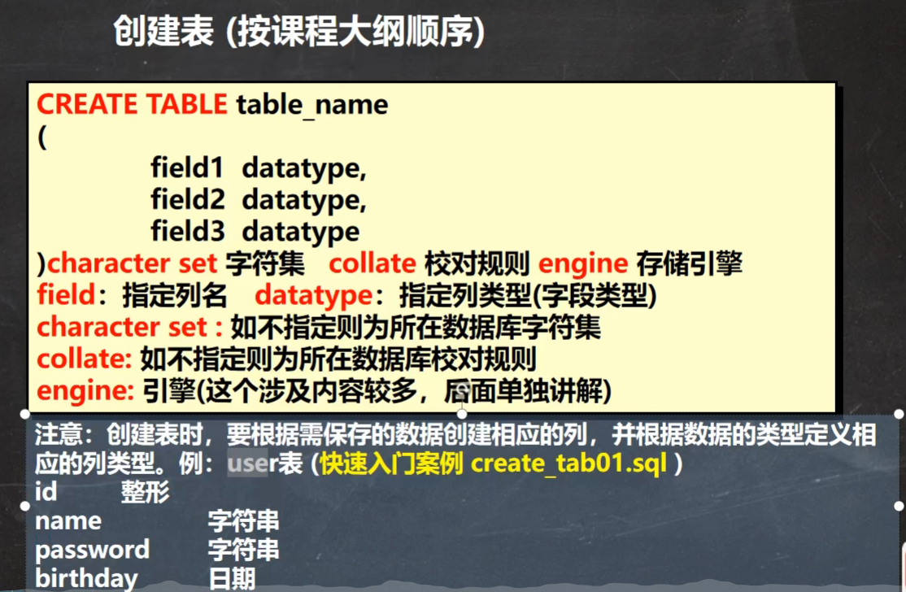

* content
  {:toc}




```mysql
CREATE TABLE `user`(
		id INT,
		`name` VARCHAR(255),
		`PASSWORD` VARCHAR(255),
		`birthday` DATE)
		CHARACTER SET utf8 COLLATE utf8_bin ENGINE INNODB;

#CHARACTER 是字符集  COLLATE 是校对规则 ENGINE 是引擎
)

#默认值的使用，当不给某个字段值时，如果有默认值会自动添加默认值，否则报错
			  --如果某个列 没有指定not null ，那么当添加数据时，没有给定值，会默认null
				--如果希望指定某个列的默认值，可以在创建表时指定
	CREATE TABLE goods(
			id INT,
			goods_name VARCHAR(10),
			price DOUBLE NOT NULL DEFAULT 100);
			
			
						#添加的顺序要与values之前的一致
			#字符和日期型都要添加到单引号中
			#列可以插入空值（前提是字段允许为空）,
			INSERT INTO goods VALUES(null,null,null)
			#可以一次添加多个
			INSERT INTO goods (id,goods_name,price)
				VALUES(15,'iphone2',4000),(30,'iphone3',6000);
```

