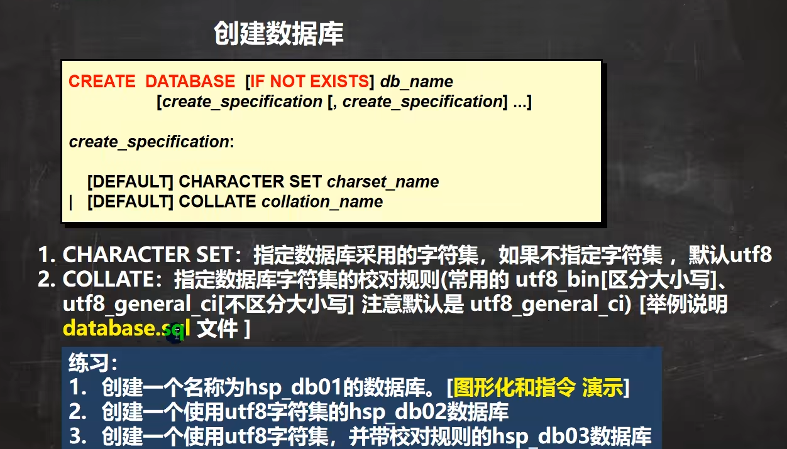

* content
  {:toc}


## MySQL   01

###   	

### 常用操作

```mysql
#删除数据库
DROP DATABASE wxh_dp01
#创建数据库
CREATE DATABASE wxh_dp01
#注意这里创建的数据库默认编码为utf-8 默认字符集校对规则为utf8_general_ci（不区分大小写）
CREATE DATABASE wxh_dp02 CHARACTER SET utf8 COLLATE utf8_bin
#utf8_bin是区分大小写的

#我们这里在运行语句的时候发现可以只允许单行命令，快捷键home shift+end 可以快速选择当前行
```

创建表时，如果没有指定字符集和校定规则，则与数据库一致


